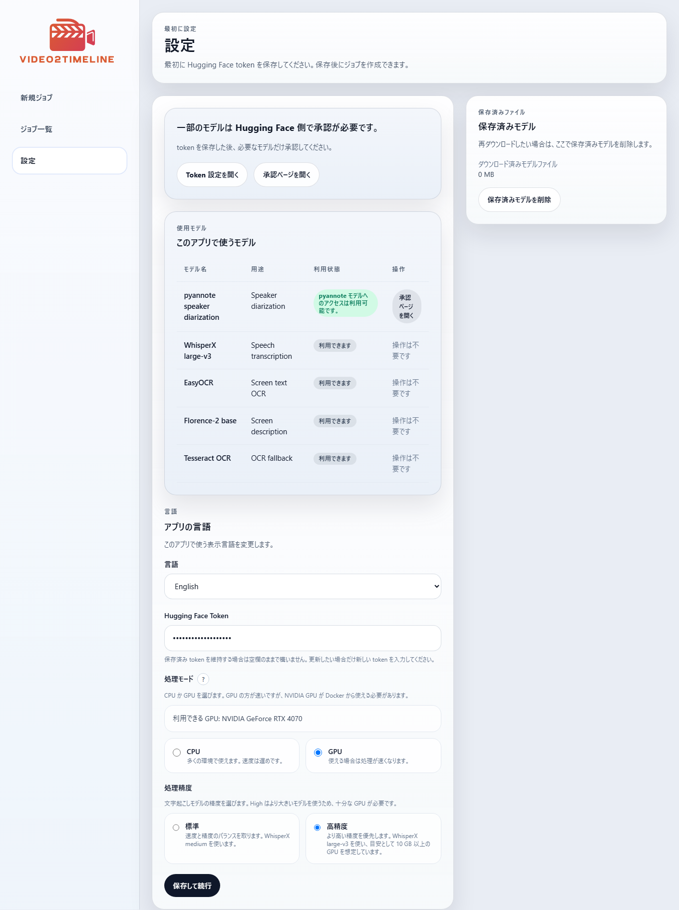
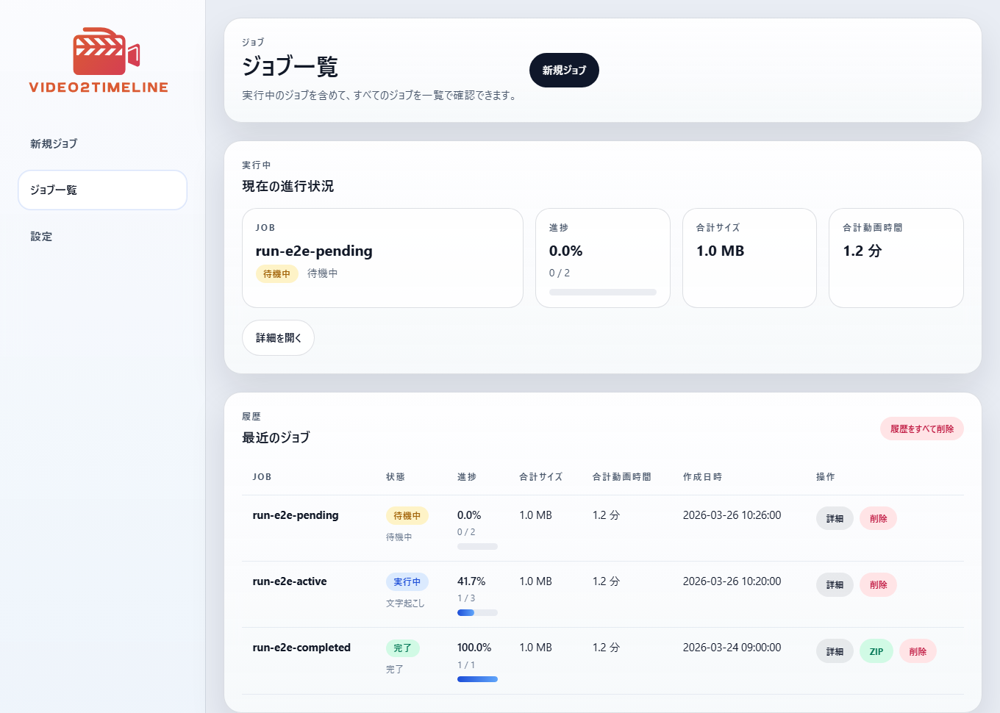
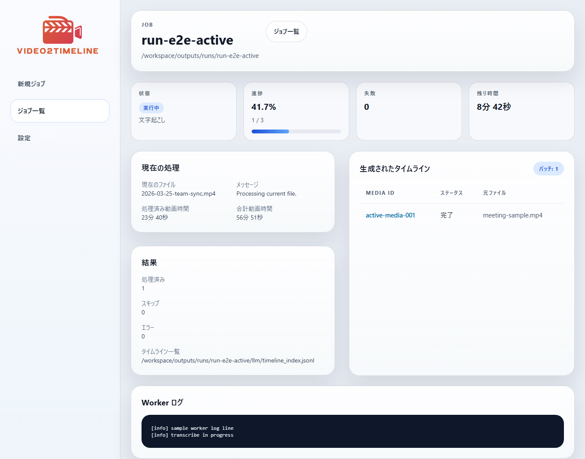

# TimelineForAudio

手元にある音声ファイルを、ChatGPT などの LLM に渡しやすいタイムライン資料へ変換するローカルツールです。

[English README](README.md) | [サンプルタイムライン](docs/examples/sample-timeline.ja.md) | [第三者ライセンス](THIRD_PARTY_NOTICES.md) | [モデルと実行環境メモ](MODEL_AND_RUNTIME_NOTES.md) | [セキュリティと安全性](docs/SECURITY_AND_SAFETY.md) | [公開前チェック](docs/PUBLIC_RELEASE_CHECKLIST.md) | [ライセンス](LICENSE)

## Public Release Status

現在の public release 系列は `TimelineForAudio v0.3.4 Tech Preview` です。

現時点の public contract:

- baseline support: Windows + Docker Desktop + CPU mode
- macOS: source-based experimental path
- GPU mode: optional, NVIDIA-only, Docker Compose の GPU worker overlay 経由
- 話者分離は optional で、`pyannote/speaker-diarization-community-1` の gated approval と Hugging Face token が必要
- これは local-first の desktop-style tool であり、hosted SaaS ではありません

## このアプリがやっていること

このアプリは、手元にある音声ファイルを、LLM に渡しやすい ZIP 資料に変換するためのものです。

内部では、主に次のことを行います。

1. 入力音声を worker 向けの安定した形式に正規化します
2. まず pass1 の ASR で全文を起こします
3. pass1 と job 単位の補助コンテキストから deterministic な plain text context を作ります
4. その merged context を使って同じ音声に pass2 の ASR をかけ、pass2 を最終 transcript として使います
5. 必要に応じて pass2 の後段で話者分離を適用し、transcript 本文は書き換えずに speaker-attributed spans を付けます
6. pause、loudness、speaking rate、pitch、overlap などの音声要約を計算します
7. 最終結果を ZIP にまとめます

使う側がモデル名や細かい内部処理を理解する必要はありません。

## どんな用途に向いているか

- 会議の振り返り
- 面談、通話、インタビューの整理
- ボイスメモや podcast archive のレビュー
- 会話ログの分析
- 手元の音声資産を LLM 向けメモへ変換する用途

## スクリーンショット

### 言語選択


### 設定



### 新規ジョブ


### ジョブ一覧



### ジョブ詳細



## 基本的な流れ

1. 音声ファイルを選ぶ  
   複数ファイルも選べます
2. 実行する
3. 完了まで待つ  
   高度な AI 処理を行うため、ある程度時間がかかります
4. ZIP をダウンロードする
5. ZIP 内の `README.html` を開く
6. 必要なら、その ZIP を ChatGPT や Claude などの LLM に渡して活用する

たとえば、次のような使い方ができます。

- 会議内容を要約する
- 決定事項や宿題を抜き出す
- 自分の説明の癖を振り返る
- 会話パターンを分析する
- 音声の蓄積を検索しやすいメモにする

## ZIP に入るもの

ダウンロードされる ZIP は、できるだけコンパクトにしつつ、主要な review artifact を分けて残します。

主に入るのは次のものです。

- `README.html`
- `TRANSCRIPTION_INFO.md`
- `timelines/<収録日時>.md`
- `pass1-transcripts/<収録日時>.md`
- `pass2-transcripts/<収録日時>.md`
- `context-docs/<収録日時>.txt`
- `speaker-summaries/<収録日時>.md`
- `audio-feature-summaries/<収録日時>.md`

例:

```text
TimelineForAudio-export.zip
  README.html
  TRANSCRIPTION_INFO.md
  timelines/
    2026-03-26 18-00-00.md
  pass1-transcripts/
    2026-03-26 18-00-00.md
  pass2-transcripts/
    2026-03-26 18-00-00.md
  context-docs/
    2026-03-26 18-00-00.txt
  speaker-summaries/
    2026-03-26 18-00-00.md
  audio-feature-summaries/
    2026-03-26 18-00-00.md
```

`README.html` が export の入口です。そこから timeline、pass1 transcript、pass2 transcript、merged context、speaker summary、audio feature summary を辿れます。

## 内部作業フォルダと ZIP の違い

Docker 内では、処理のためにもう少し大きな作業フォルダを持っています。

そこには、たとえば次のようなものが入ります。

- request / status / result / manifest の JSON
- worker ログ
- 正規化済み音声や probe 情報
- pass1 / pass2 transcript の JSON と markdown
- context builder artifact と pass diff JSON
- speaker summary / audio feature summary の JSON と markdown
- 一時ファイル

これらはアプリ内部で使うものです。普段ユーザーが見るのは、ダウンロードした ZIP の中身だけで十分です。

## クイックスタート

Windows:

```powershell
.\start.bat
```

`v0.3.4` の public release では、これが primary supported path です。

macOS:

```bash
./start.command
```

こちらは `v0.3.4` では experimental な source-based path です。現在の public release line の baseline support には含めません。

起動後の流れ:

1. 言語を選ぶ
2. `Settings` を開く
3. 話者分離を使いたい場合は Hugging Face token を保存する
4. `CPU` か `GPU` を選ぶ
5. 処理精度を選ぶ
6. 新しいジョブを作る
7. 処理完了まで待つ
8. ZIP をダウンロードする

起動スクリプトは、Google Chrome / Microsoft Edge / Brave / Chromium のいずれかで専用ウィンドウ風に開こうとします。使えない場合は通常のブラウザで開きます。

## 必要なもの

- primary supported path としての Windows
- experimental な source-based path としての macOS
- Docker Desktop
- 初回のコンテナ・モデル取得用のインターネット接続
- `pyannote` 話者分離を使う場合のみ Hugging Face token
- `pyannote` 話者分離を使う場合のみ gated approval
- GPU モードを使う場合は NVIDIA GPU と Docker GPU 対応

## 計算モード

public release の baseline は CPU mode です。

public release の baseline は `CPU + Standard` です。

- `CPU + Standard`
  - baseline lane
  - `faster-whisper medium`
  - diarization 既定値: off
- `CPU + High`
  - expert lane
  - `faster-whisper large-v3`
  - 遅くなりやすいですが利用できます
  - diarization 既定値: off
- `GPU + Standard`
  - practical fast lane
  - `faster-whisper medium`
  - Hugging Face token と gated approval が揃えば diarization 既定値: on
- `GPU + High`
  - 推奨の best-quality lane
  - `faster-whisper large-v3`
  - 実用目安は 10 GB 以上の VRAM
  - 8-10 GB は experimental / expert 扱い

この開発環境では `NVIDIA GeForce RTX 4070` で GPU 実行を確認しています。

## 対応する入力形式

主な対応形式:

- `.mp3`
- `.wav`
- `.m4a`
- `.aac`
- `.flac`

実際に読み込めるかどうかは、ランタイムイメージ内の `ffmpeg` に依存します。

## 言語対応

対応言語:

- `en`
- `ja`
- `zh-CN`
- `zh-TW`
- `ko`
- `es`
- `fr`
- `de`
- `pt`

初回起動時の既定は英語です。選択した言語は `.env` ではなくアプリ設定データに保存されます。

## CLI

通常利用の入口は GUI です。必要なら worker CLI も使えます。

初回 public release では GUI を primary path とします。CLI は advanced path であり、daemon と CLI を同時に回す運用は public support guarantee に含めません。

主なコマンド:

- `settings status`
- `settings save`
- `jobs create`
- `jobs list`
- `jobs show`
- `jobs run`
- `jobs archive`

例:

```powershell
$env:PYTHONPATH=".\worker\src"
python -m timeline_for_audio_worker settings status
python -m timeline_for_audio_worker settings save --token hf_xxx --terms-confirmed
python -m timeline_for_audio_worker jobs create --file C:\path\to\clip.wav
python -m timeline_for_audio_worker jobs create --directory C:\path\to\folder
python -m timeline_for_audio_worker jobs list
python -m timeline_for_audio_worker jobs archive --job-id run-YYYYMMDD-HHMMSS-xxxx
```

`jobs archive` を使うと、GUI でダウンロードするのと同じような ZIP 形式で出力できます。

## テスト

現在のテストは軽めです。

- Python worker の unit test
- ASP.NET Core UI の Playwright ベース smoke test
- 実データでの手動 smoke test

worker unit test:

```powershell
$env:PYTHONPATH=".\worker\src"
python -m unittest discover .\worker\tests
```

ブラウザ E2E:

```powershell
.\scripts\test-e2e.ps1
```

commit 前に lint を有効にする場合:

```powershell
git config core.hooksPath .githooks
```

## ライセンス

このリポジトリは MIT License です。詳細は [LICENSE](LICENSE) を参照してください。
