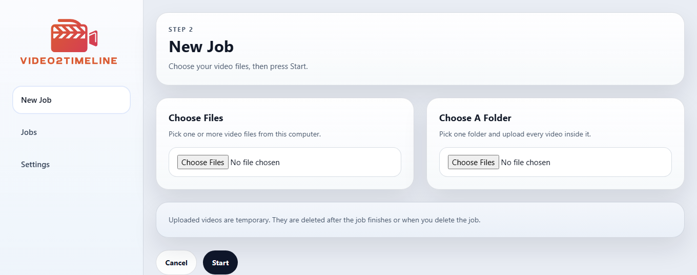
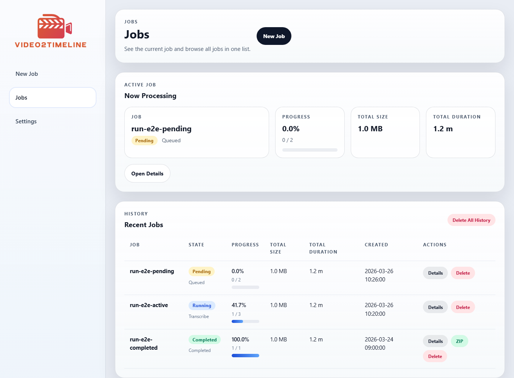
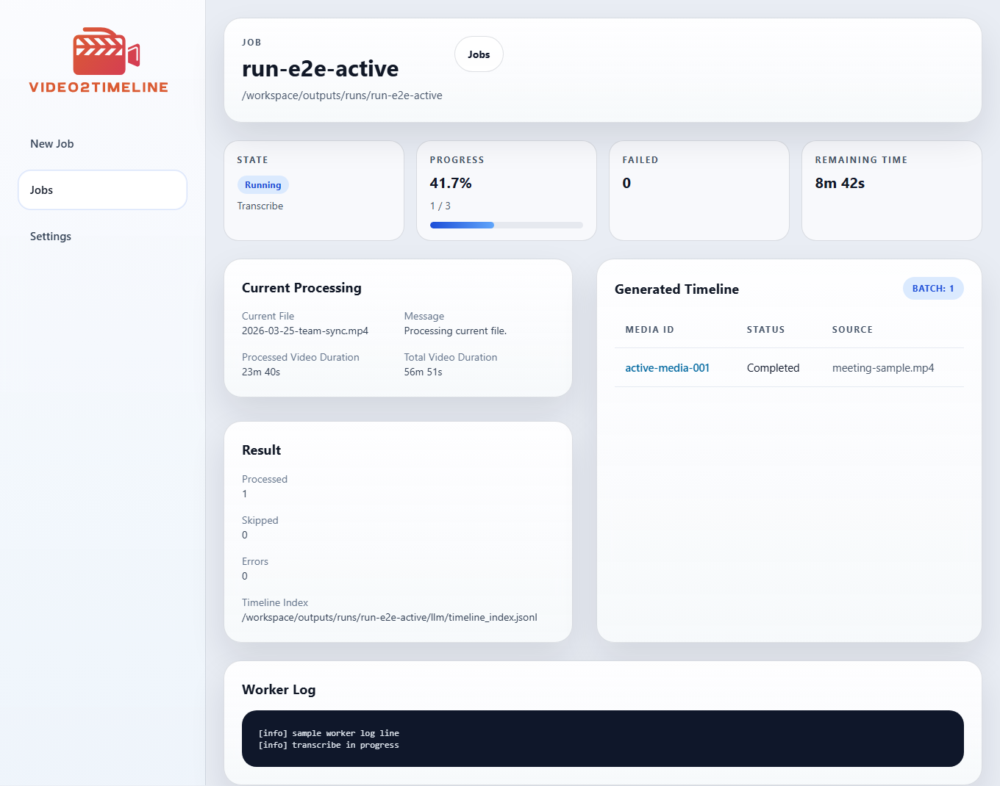

# TimelineForAudio

Turn local audio files into IPA-first markdown packages that are easier to review locally and easier to hand to ChatGPT or other LLM tools.

[Japanese README](README.ja.md) | [Sample Timeline](docs/examples/sample-timeline.en.md) | [Third-Party Notices](THIRD_PARTY_NOTICES.md) | [Model and Runtime Notes](MODEL_AND_RUNTIME_NOTES.md) | [Security And Safety](docs/SECURITY_AND_SAFETY.md) | [Release Checklist](docs/PUBLIC_RELEASE_CHECKLIST.md) | [License](LICENSE)

## Public Release Status

The current public release line is `TimelineForAudio v0.4.0 Tech Preview`.

Current public contract:

- baseline support: Windows + Docker Desktop + CPU mode
- macOS: source-based experimental path
- GPU mode: optional, NVIDIA-only, via a dedicated GPU worker overlay for Docker Compose
- speaker diarization: optional, requires a Hugging Face token plus gated approval for `pyannote/speaker-diarization-community-1`
- this is a local-first desktop-style tool, not a hosted SaaS product

## What This App Does

This app takes audio files on your computer and turns them into two review-ready outputs:

- `IPA.md`
- `Readable Text.md`

Inside the app, the main flow is:

1. normalize the input audio into a stable worker format
2. transcribe the recording into cleanup-oriented source text
3. align speaker-aware turns when diarization is available
4. derive turn-level IPA as the canonical intermediate
5. reconstruct readable turn text from IPA, language hint, and optional supplemental context
6. package either the IPA view or the Readable Text view into a ZIP file

The app keeps audio-relative timestamps per turn. The downloadable ZIP does not include the original audio file.

## Typical Uses

- meeting review
- interview or call review
- voice memo and podcast archive review
- conversation history analysis
- turning local audio archives into LLM-ready notes

## Screenshots

### Language


### Settings


### New Job



### Jobs



### Job Details



## Basic Flow

1. choose your audio files
2. start processing
3. wait for completion  
   Advanced AI processing takes some time
4. download either the IPA ZIP or the Readable Text ZIP
5. open `README.html` inside the ZIP
6. upload the ZIP to ChatGPT, Claude, or another LLM if you want downstream analysis

Examples of what you can ask an LLM after that:

- summarize the meeting
- extract decisions and action items
- review how I explained things
- analyze conversation patterns
- turn voice archives into searchable notes

## What Is Inside The ZIP

The ZIP is intentionally compact and output-specific.

IPA ZIP:

- `README.html`
- `CONVERSION_INFO.md`
- `ipa/<captured-datetime>.md`

Readable Text ZIP:

- `README.html`
- `CONVERSION_INFO.md`
- `readable-text/<captured-datetime>.md`

Example:

```text
TimelineForAudio-ipa.zip
  README.html
  CONVERSION_INFO.md
  ipa/
    2026-03-26 18-00-00.md

TimelineForAudio-readable-text.zip
  README.html
  CONVERSION_INFO.md
  readable-text/
    2026-03-26 18-00-00.md
```

`README.html` is the export entrypoint. It links to the generated artifact and explains the conversion at a high level.

## Internal Working Files vs ZIP Output

Inside Docker, the app keeps a larger working folder for processing, logs, and intermediate files.

That internal folder can contain:

- request, status, result, and manifest JSON files
- worker logs
- normalized audio and probe metadata
- cleanup-source and turn-source transcript JSON and markdown
- context builder artifacts and transcript delta JSON
- IPA and readable-text internal artifacts
- speaker alignment metadata
- temporary processing files

Those files are for the app itself. The downloadable ZIP is the reduced handoff package for LLM use.

## Quick Start

Windows:

```powershell
.\start.bat
```

This is the primary supported path for the `v0.4.0` public release line.

The web UI now builds Tailwind CSS and TW Elements assets locally inside Docker. It no longer depends on the Tailwind CDN at runtime.

macOS:

```bash
./start.command
```

This path is available as an experimental source-based setup in `v0.4.0`. It is not the baseline support contract for the current public release line.

Then:

1. choose your language
2. open `Settings`
3. save your Hugging Face token if you want speaker diarization
4. choose `CPU` or `GPU`
5. create a new job
6. wait for processing to finish
7. download the IPA ZIP or Readable Text ZIP

`transformers` is included in the worker because the IPA-first pipeline now runs local readable-text reconstruction in `GPU + Japanese language hint` jobs.

The start script tries to open an app-style window with Google Chrome, Microsoft Edge, Brave, or Chromium. If none of those are available, it falls back to a normal browser window.

## Requirements

- Windows for the primary supported path
- macOS only if you are comfortable with an experimental source-based setup
- Docker Desktop
- internet access on first run for container and model downloads
- optional Hugging Face token if you want `pyannote` diarization
- optional gated-model approval for `pyannote`
- NVIDIA GPU plus Docker GPU access if you want GPU mode

## Compute Modes

The public UI exposes only two compute choices:

- `CPU`
  - baseline lane
  - slower, but available on the broadest range of machines
- `GPU`
  - NVIDIA-only path through the GPU worker overlay
  - faster on supported machines

Model selection and reconstruction details stay internal. The app does not expose `standard` / `high` quality modes in the current UI.

In this development environment, GPU execution was verified on `NVIDIA GeForce RTX 4070` with Docker GPU access.

## Supported Input Formats

Primary support:

- `.mp3`
- `.wav`
- `.m4a`
- `.aac`
- `.flac`

Actual decoding still depends on the `ffmpeg` build inside the runtime image.

## Localization

Supported locales:

- `en`
- `ja`
- `zh-CN`
- `zh-TW`
- `ko`
- `es`
- `fr`
- `de`
- `pt`

English is the default on first launch. The selected language is stored in the app settings data, not in `.env`.

## CLI

The GUI is the main entry point. A worker CLI is also available for scripting and direct local execution.

For the initial public release, the GUI is the primary supported path. The CLI is an advanced path, and concurrent daemon plus CLI operation is not part of the public support guarantee.

Common commands:

- `settings status`
- `settings save`
- `jobs create`
- `jobs list`
- `jobs show`
- `jobs run`
- `jobs archive`

Example:

```powershell
$env:PYTHONPATH=".\worker\src"
python -m timeline_for_audio_worker settings status
python -m timeline_for_audio_worker settings save --token hf_xxx --terms-confirmed
python -m timeline_for_audio_worker jobs create --file C:\path\to\clip.wav
python -m timeline_for_audio_worker jobs create --directory C:\path\to\folder
python -m timeline_for_audio_worker jobs list
python -m timeline_for_audio_worker jobs archive --job-id run-YYYYMMDD-HHMMSS-xxxx
```

`jobs archive` creates the same reduced ZIP-style handoff package that the GUI downloads.

## Testing

Current test coverage is intentionally lightweight:

- Python worker unit tests
- Playwright-based E2E smoke tests for the ASP.NET Core UI
- manual smoke runs with real local jobs

Run worker unit tests:

```powershell
$env:PYTHONPATH=".\worker\src"
python -m unittest discover .\worker\tests
```

Run browser E2E tests:

```powershell
.\scripts\test-e2e.ps1
```

Enable commit-time lint checks:

```powershell
git config core.hooksPath .githooks
```

## License

This repository is licensed under the MIT License. See [LICENSE](LICENSE).

